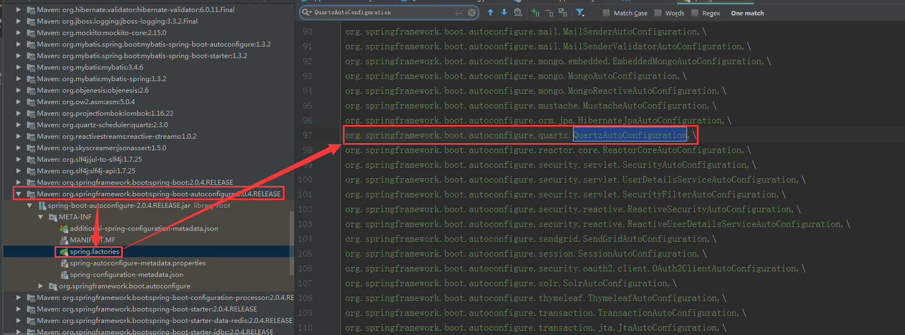
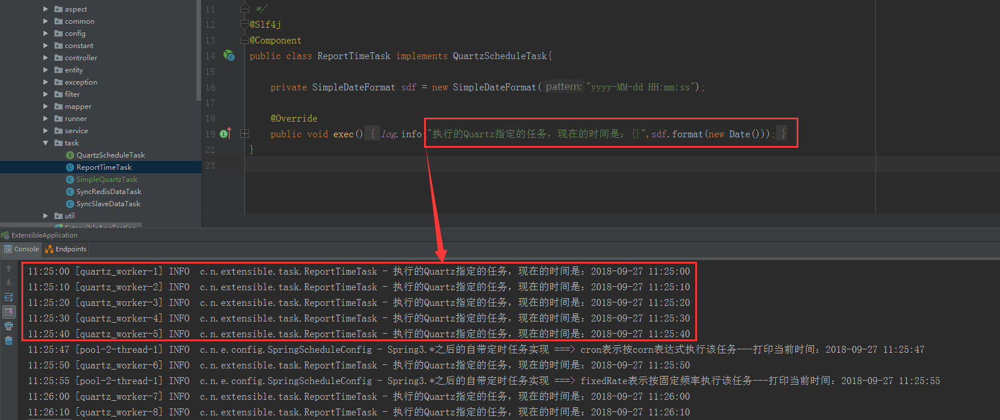

# SpringBoot整合Quartz实现多定时任务

## 定时任务的使用场景

在项目的开发过程中，我们经常会遇到类似这样的需求：需要定期执行某一项工作，或者按照特定计划执行某些工作。这时我们就需要用到定时任务的实现。

## SpringBoot对定时任务的支持

日常开发中，定时任务最常用的实现方式有如下两种：
- Spring-3.*版本之后，自带定时任务的实现
- SpringBoot-2.*版本之后，均实现了Quartz的自动配置

## Spring自带定时任务的实现---@Scheduled注解

Spring自带定时任务的实现，是靠@Scheduled注解实现的。在SpringBoot项目中，我们想使该注解生效，还需要在类上加注解**@EnableScheduling**，开启对Spring定时任务的支持，源码如下：

```JAVA
/**
 * @author zhenye 2018/9/21
 */
@Configuration
@EnableScheduling
@Slf4j
public class SpringScheduleConfig {

    private SimpleDateFormat sdf = new SimpleDateFormat("yyyy-MM-dd HH:mm:ss");

    @Scheduled(fixedRate = 1000 * 60L)
    public void runIntervalTask(){
        log.info("Spring3.*之后的自带定时任务实现 ===> fixedRate表示按固定频率执行该任务---打印当前时间：{}",sdf.format(new Date()));
    }

    @Scheduled(cron = "47 * * * * ?")
    public void runCornExpTask(){
        log.info("Spring3.*之后的自带定时任务实现 ===> cron表示按corn表达式执行该任务---打印当前时间：{}",sdf.format(new Date()));
    }
}
```

上面的两个定时任务就是基于注解@Scheduled实现的。
- runIntervalTask(),是一个按固定频率运行的任务，每1分钟执行一次。
- runCornExpTask(),是一个按corn表达运行的任务，每分钟的第47秒运行一次。

启动项目后，效果图如下：


我们查看@Scheduled的源码如下：

```JAVA

```

## SpringBoot整合Quartz

SpringBoot从2.0版本之后，就开启了对Quartz自动配置的支持。
如：我使用的SpringBoot版本为：2.0.4



Quartz中最重要的几个概念解释：
- Scheduler,调度器。作用：用来统一管理工作内容、工作计划周期。
- JobDetail,作业实例。作用：定义某项具体工作的工作内容。
- Trigger,触发器。作用：定义某项具体工作的执行频率。

这些抽象概念不是那么容易理解，我以“吃饭”来简单讲解一下它们的含义。
比如我给自己定了一个计划表：每天8点到8点半吃早饭，每天12点到12点半吃午饭等等。**这个计划表，就是调度器（Scheduler）**,调度器告诉我们什么时候该干什么。然后，早饭吃的是豆浆+油条，午饭吃的是米饭。**早饭、午饭就是作业实例（JobDetail）**，作业实例是用来定义某项具体工作的工作内容。最后，**8点到8点半、12点到12点半就是两个触发器（Trigger）**，触发器关联某个作业实例，告诉该作业实例什么时候进行作业。<br/>
从上面的事例说明，我们就很容易看出这三者之间的关系。

### 单任务的实现

SpringBoot-2.0开启了Quartz的自动配置，因此单定时任务的实现非常简单。直接上代码：

首先，在pom文件中加入自动配置依赖

```XML
<dependency>
    <groupId>org.springframework.boot</groupId>
    <artifactId>spring-boot-starter-quartz</artifactId>
</dependency>
```
然后，定义该定时任务的具体工作内容

```JAVA
@Slf4j
public class SimpleQuartzTask  extends QuartzJobBean{
    /**
     * 实现QuartzJobBean的executeInternal()方法，即可定义工作内容
     */
    @Override
    protected void executeInternal(JobExecutionContext jobExecutionContext) throws JobExecutionException {
        log.info("简单的单Quartz任务开始---");
        try {
            Thread.sleep(4000L);
        } catch (InterruptedException e) {
            log.error("线程阻塞失败。",e);
        }
        log.info("简单的单Quartz任务结束---");
    }
}
```

最后，将该定时任务的工作内容和触发器进行配置即可。

```JAVA
/**
 * @author zhenye 2018/9/26
 */
@Configuration
public class SimpleQuartzConfig {

    @Bean
    public JobDetail simpleQuartzTaskDetail(){
        return JobBuilder.newJob(SimpleQuartzTask.class).withIdentity("simpleQuartzTask").storeDurably().build();
    }

    @Bean
    public Trigger simpleQuartzTaskTrigger(){
        CronScheduleBuilder scheduleBuilder = CronScheduleBuilder.cronSchedule("*/3 * * * * ?");
        return TriggerBuilder.newTrigger().forJob(simpleQuartzTaskDetail())
                .withIdentity("simpleQuartzTask")
                .withSchedule(scheduleBuilder)
                .build();
    }
}
```

启动项目，即可看到单定时任务的执行效果图如下：


### 多任务的实现

实际项目的开发过程中，可能要实现多个定时任务。如果用上面“单任务”的模板定义，定时任务的配置类就会显得呆板复杂，程序可读性也会很差。

因此多任务的实现，需要换种方式进行配置。实际代码如下：

首先，还是要在pom文件中导入依赖

```XML
<dependency>
    <groupId>org.springframework.boot</groupId>
    <artifactId>spring-boot-starter-quartz</artifactId>
</dependency>
```
然后，定义一个任务接口

```JAVA
/**
 * @author zhenye 2018/9/21
 */
public interface QuartzScheduleTask {
    /**
     * 该方法的实现，表示某个任务的具体工作内容
     */
    void exec();
}
```

再在properties配置文件中配置quartz的部分参数

```YML
# quartz定时任务相关的配置
quartz.scheduler-name=QUARTZ_SCHEDULER
quartz.thread-count=10
quartz.thread-name-prefix=quartz_worker
quartz.tasks=\
    ReportTimeTask:*/10 * * * * ? *
```

再自定义quartz的配置

```JAVA
/**
 * quartz定时任务的配置类
 * @author zhenye 2018/9/21
 */
@Configuration
@ConfigurationProperties("quartz")
@Getter
@Setter
public class QuartzScheduleConfig {

    private String schedulerName;
    private String threadCount;
    private String threadNamePrefix;
    private String tasks;
    private final ApplicationContext context;

    @Autowired
    public QuartzScheduleConfig(ApplicationContext context) {
        this.context = context;
    }

    @Bean
    public SchedulerFactoryBean schedulerFactoryBean() {
        Properties properties = new Properties();
        properties.setProperty("org.quartz.threadPool.threadCount", threadCount);
        properties.setProperty("org.quartz.threadPool.threadNamePrefix", threadNamePrefix);
        SchedulerFactoryBean factory = new SchedulerFactoryBean();
        factory.setSchedulerName(schedulerName);
        factory.setQuartzProperties(properties);
        return factory;
    }

    @Bean
    public Scheduler scheduler() throws Exception {
        Scheduler scheduler = schedulerFactoryBean().getScheduler();
        scheduler.scheduleJobs(createJobDetails(), true);
        return scheduler;
    }

    /**
     * 创建JobDetail
     * 使用是Spring的MethodInvokingJobDetailFactoryBean来创建JobDetail
     * 使用Spring的ronTriggerFactoryBean来创建CronTrigger
     *
     * @return Map<JobDetail, Set<CronTrigger>>
     */
    private Map<JobDetail, Set<? extends Trigger>> createJobDetails(){
        Set<String> taskSet = StringUtils.commaDelimitedListToSet(tasks);
        Map<JobDetail, Set<? extends Trigger>> map = new HashMap<>(taskSet.size());
        for (String task : taskSet) {
            String[] nameAndCron = task.split(":");
            String name = StringUtils.uncapitalize(nameAndCron[0]);
            String cron = nameAndCron[1];
            MethodInvokingJobDetailFactoryBean factoryBean = new MethodInvokingJobDetailFactoryBean();
            factoryBean.setTargetObject(context.getBean(name));
            factoryBean.setName(name);
            factoryBean.setTargetMethod(QuartzScheduleTask.class.getMethods()[0].getName());
            factoryBean.afterPropertiesSet();
            CronTriggerFactoryBean cronTriggerFactoryBean = new CronTriggerFactoryBean();
            cronTriggerFactoryBean.setCronExpression(cron);
            cronTriggerFactoryBean.setJobDetail(factoryBean.getObject());
            cronTriggerFactoryBean.setName(name);
            cronTriggerFactoryBean.afterPropertiesSet();
            Set<CronTrigger> cronTriggerSet = new HashSet<>(1);
            cronTriggerSet.add(cronTriggerFactoryBean.getObject());
            map.put(factoryBean.getObject(), cronTriggerSet);
        }
        return map;
    }
}
```

最后，进行某项具体任务中工作内容的实现

```JAVA
/**
 * @author zhenye 2018/9/21
 */
@Slf4j
@Component
public class ReportTimeTask implements QuartzScheduleTask{

    private SimpleDateFormat sdf = new SimpleDateFormat("yyyy-MM-dd HH:mm:ss");

    @Override
    public void exec() {
        log.info("执行的Quartz指定的任务，现在的时间是：{}",sdf.format(new Date()));
    }
}
```

这样，就把多定时任务的配置简化了，启动项目可以看到如下效果图：



然后，需要定义其他定时任务时，只需要两步：
1. 实现QuartzScheduleTask的exec()方法，定义该定时任务的工作内容；
2. 在配置文件中加上该定时任务的触发器。

多任务的配置说明：<br/>
SpringBoot是将一个定时任务看做一个方法。上面配置的做法是：
- 首先，读取配置文件中quartz.tasks中定义的任务名称及该任务的触发器。 
- 然后，通过ApplicationContext（应用上下文对象），根据任务名称获取到相应的任务对象实例。
- 再然后，通过Spring的MethodInvokingJobDetailFactoryBean注册JobDetail，该任务实例的第一个方法就是该任务的工作内容；通过Spring的CronTriggerFactoryBean注册CornTrigger，该任务实例在配置文件中的内容，就是该任务的触发器。
- 把该任务的工作内容和触发器放在Map中，通过schedule的scheduleJobs()方法将所有JobDetail和Trigger添加到调度器中。
- 这样SpringBoot就会帮我们管理调度器schedule实例，并自动按计划执行相应的定时任务。

这里还需要注明一点：配置了多任务后，之前的单任务会失效。因为自定义的调度器Schdule中，并没有加入该单任务对应的JobDetail和Trigger，所以该调度器不会管理该单任务。

## corn表达式简介

不管是Spring自带的定时任务实现，还是SpringBoot整合Quartz的定时任务实现，其触发器都支持用corn表达式来表示。<br/>

<font color="red">corn表达式是一个字符串，有6或7个域，域之间是用空格进行间隔。</font>

从左到右每个域表示的含义如下：

|第几个域|英文释义   |允许值        |备注|
|-------|----------|--------------|---|
|一     |Seconds   |0~59          |秒 |
|二     |Minutes   |0~59          |分 |
|三     |Hours     |0~23          |时 |
|四     |DayOfMonth|1-31          |天 |
|五     |Month     |1-12或月份简写 |月 |
|六     |DayOfWeek |1-7或星期简写  |星期，1表示SUN|
|七     |Year      |1970~2099     |年 |

然后，某些域还支持部分特殊字符，特殊字符的含义如下：

|特殊字符|含义及注意事项                                     |
|:-----:|--------------------------------------------------|
|*      |任意值                                             |
|?      |占位符，只能在第四域和第六域中使用                   |
|-      |区间，表示区间内有效                                |
|/      |固定间隔                                           |
|,      |枚举有效值的间隔符                                  |
|L      |表示该区间的最后一个有效值，只能在第四域和第六域中使用 |
|W      |表示离指定日期的最近的有效工作日，（周一-周五为工作日）|

常用corn表达式例子含义说明：

|corn表示式                 |表达式含义                                |
|--------------------------|------------------------------------------|
|*/10 * * * * ? *          |每隔10秒执行一次                           |
|0 30 1 * * ? *            |每天凌晨1点30分0秒开始执行                  |
|0 0 10,14,16 * * ?        |每天10点、14点、16点执行一次                |
|0 15 10 L * ?             |每个月最后一天的10点15分执行一次             |
|0 15 10 ? * 6L 2018-2020  |2018年到2020年每个月最后一个星期五的10:15执行|